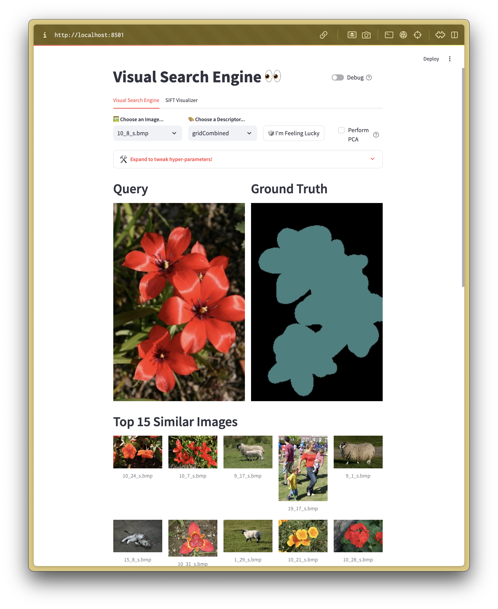

# Computer Vision & Pattern Recognition
Hello! This is an assignment repository for the University of Surrey's CVPR class regarding visual search. I have built a GUI with some visualizations and interactive elements using [`Streamlit`](https://streamlit.io/) and [`Firebase`](https://firebase.google.com/). The assignment 1 write-up: Visual Search System can be found on my personal Notion page [here](https://www.notion.so/frankcholula/Visual-Search-System-1223b40fbcd5801abc19e3ceadf9cb6e?pvs=4).

The stripped-down, beta version has been deployed [here](https://visual-search.streamlit.app/) and will have more functionalities added soon. If you want a fully working version, please run it locally using the instruction below.

If you are a **University of Surrey student**, you are welcome to use this project as a learning resource and reference for your coursework. A simple credit to the OC (wee! that's me, [Frank](https://frankcholula.notion.site/)) would be greatly appreciated. However, please note that submitting this work as your own academic assignment is not permitted and may lead to [academic misconduct penalties](https://www.surrey.ac.uk/office-student-complaints-appeals-and-regulation/academic-misconduct-and-appeals). Just make sure you're submitting your orignal work.
## Directory Layout
To get started, you'll need to install the dependencies. I'm using [Poetry](https://python-poetry.org/) to manage the dependencies and [Pyenv](https://github.com/pyenv/pyenv) to manage the Python version.

For Mac users, you can install both using homebrew:
```bash
brew install pyenv poetry
```

## Running Locally
Clone the repository, start a poetry virtual environment and install the dependencies.
```bash
poetry shell
poetry install
make run
```
The `make run` command should start a streamlit interactive GUI on `localhost:8501`.


## Deployment
A stripped-down version of this project is currently live on Streamlit at [visual-search.streamlit.app](https://visual-search.streamlit.app/). I'll publish the complete version after the assignment deadline to comply with the University of Surrey's academic integrity policy. The goal of this project is to serve as a learning resource and reference for future students.

## Checklist
- [x] **Req No. 1: Global Colour Histogram** (30%)  
  - Implement the global colour histogram from lecture 7 (slides 4,5) using a Euclidean distance metric.  
  - Experiment with different levels of RGB quantization.

- [x] **Req No. 2: Evaluation Methodology** (25%)  
  - Compute precision-recall (PR) statistics for each of your experiments, e.g., PR for the top 10 results.  
  - Plot the PR curve.  
  - If similarity is defined in terms of object categories, compute a confusion matrix.  
  - Discuss and analyze your results (e.g., which experiments were most successful, which images worked well, and why given your descriptor choice).

- [x] **Req No. 3: Spatial Grid (Colour and Texture)** (15%)  
  - Implement gridding of the image and concatenate features from grid cells to form the image descriptor.  
  - Experiment with colour and/or texture features.  
  - Experiment with different levels of angular quantization for texture features.

- [x] **Req No. 4: Use of PCA** (15%)  
  - Use PCA to project your image descriptors into a lower-dimensional space.  
  - Explore the use of Mahalanobis distance as an alternative distance metric.  
  - Analyze whether performance improves.

- [x] **Req No. 5: Different Descriptors and Distance Measures** (15%)  
  - Experiment with different choices of distance measures (e.g., L1 norm) and note their effect on performance.  
  - Discover and try out other distance measures or descriptors not covered in the module.

- [ ] **Req No. 6: Bag of Visual Words Retrieval (Hard)** (40%)  
  - Implement a basic BoVW system using a sparse feature detector (e.g., Harris or SIFT keypoint detector) and a descriptor (e.g., SIFT descriptor).  
  - Use k-Means to create the codebook.  
  - Compare the performance with other descriptors you have tried.

- [ ] **Req No. 7: Object Classification Using SVM (Hard)** (30%)  
  - Apply an SVM to classify image categories (e.g., “bike” or “sheep”) based on extracted descriptors.  
  - Note: This is classification, not strictly visual search.

- [ ] **Req No. 8: Extra Credit** (20%)  
  - Propose and implement your own idea based on the above themes or an entirely new concept.  
  - Focus on technical merit related to Computer Vision, not UI or fancy coding.
